# 🛡️ Instagram Safe Unfollower (Hybrid & Open Source)

Welcome! This tool helps you clean up your Instagram account by identifying users who don't follow you back and safely unfollowing them.

Unlike other bots that get you banned, this tool uses a **"Hybrid Method"**: it reads your official data export (safe) to find targets, and then mimics a human (slowly) to unfollow them.

## ⚠️ Disclaimer
**This tool is for educational purposes only.** Automating actions on Instagram accounts allows you to interact with the API in ways that may be contrary to Instagram's Terms of Service. 
* The author of this repository is not responsible for any actions taken by the user.
* The author is not responsible for any banned, blocked, or restricted accounts.
* Use this tool at your own risk.

---

## 🚨 READ ME FIRST: Safety & Privacy
**Is this safe? Does it steal my password?**

* **No Passwords Needed:** This tool **does not** ask for your password. It uses your browser's "Session Cookie" (a temporary key) to perform actions on your behalf.
* **Your Data Stays With You:** The script runs **locally** on your computer. Your cookies and data are never sent to any external server.
* **Anti-Ban Technology:**
    * It uses **Randomized Delays** (e.g., waits 45 seconds, then 92 seconds) so Instagram thinks you are a human, not a robot.
    * It has a **Daily Limit** (default: 20 actions) to prevent "Action Blocks."

> **⚠️ Important:** Never share your `config.json` file or your Session ID with anyone. Treating your Session ID like a password is the best practice!

---

## 🛠️ Prerequisites

Before starting, you need a few simple things installed on your computer:

1.  **Python (The engine):** [Download Python here](https://www.python.org/downloads/). (Make sure to check the box **"Add Python to PATH"** during installation).
2.  **A Computer:** Windows, Mac, or Linux.
3.  **Instagram Account:** You must be logged in on Chrome or Edge browser.

---

## 🚀 Step-by-Step Guide

Click on the sections below to expand the instructions.

<details>
<summary><strong>Step 1: Download the Project</strong> (Click to Expand)</summary>

You have two options to get the code:

**Option A: Clone via Git (Recommended)**
If you have Git installed, run this command in your terminal:
```bash
git clone https://github.com/manuthRJ/instagram-unfollower.git
cd instagram-unfollower
```
**Option B: Download ZIP**
1.  Click the green **"Code"** button at the top of this GitHub page.
2.  Select **"Download ZIP"**.
3.  Extract (Unzip) the folder to your computer.
4.  Open that folder in your terminal or command prompt.

</details>

<details>
<summary><strong>Step 2: Install Requirements</strong></summary>

We need to install the necessary libraries for the tool to work.

1.  Open your **Terminal** (Mac/Linux) or **Command Prompt** (Windows) inside the project folder.
2.  Run the following command:

```bash
pip install -r requirements.txt
``` 

If you see "Successfully installed", you are good to go!

</details>

<details> <summary><strong>Step 3: Get Your Instagram Data</strong> (Crucial Step)</summary>

To keep your account safe, we don't "scrape" your followers. We use the official data Instagram gives you.

**1. Request the Download**
Go to **Settings** -> **Account Center** -> **Your Information & Permissions** -> **Export Your Information**.

<div align="center">
  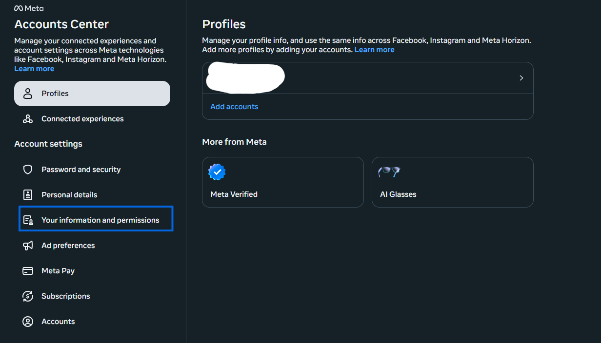
</div>

<div align="center">
  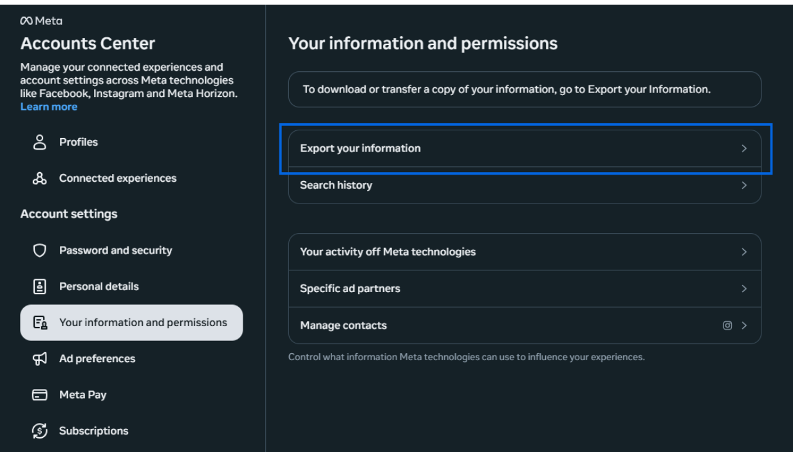
</div>

**2. Choose Format (IMPORTANT)**
Select **"Export to device"**. Under the "Format" option, you **MUST** select **JSON**. Do not select HTML.

<div align="center">
  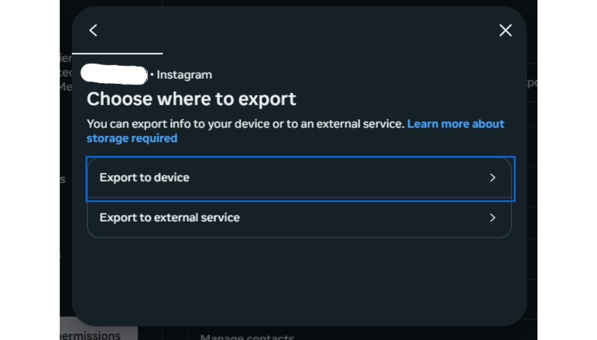
</div>

<div align="center">
  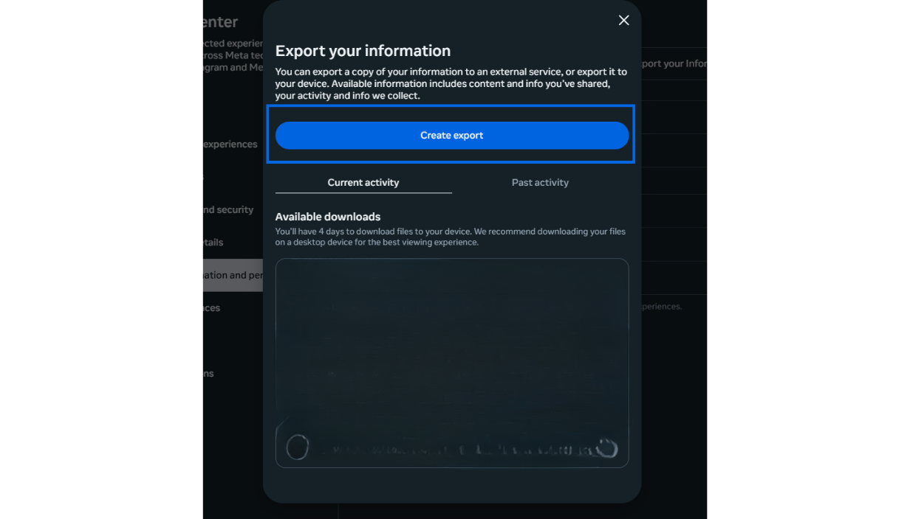
</div>

<div align="center">
  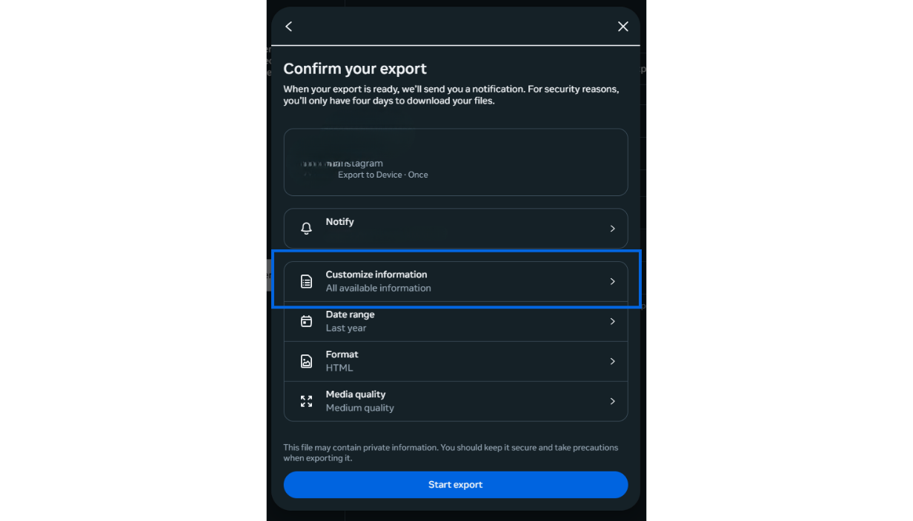
</div>

<div align="center">
  
</div>

**3. Select Customize Information**
Clear all other selected boxes and scroll down and check the boxes for **"Connections"**. Then select **"Followers and following"**.

<div align="center">
  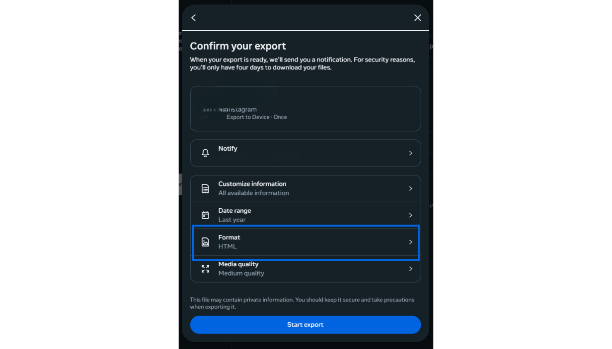
</div>

<div align="center">
  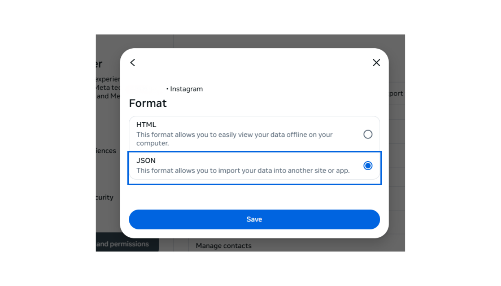
</div>

**4. Set Date Range to All time**

<div align="center">
  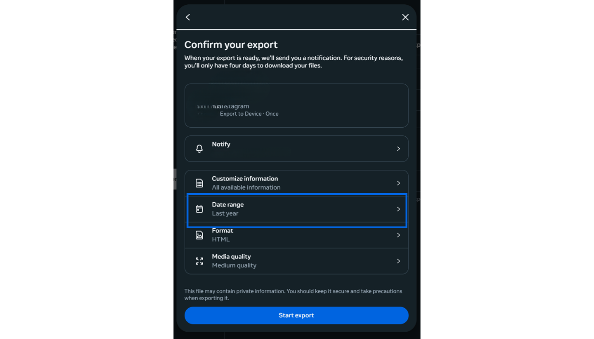
</div>

<div align="center">
  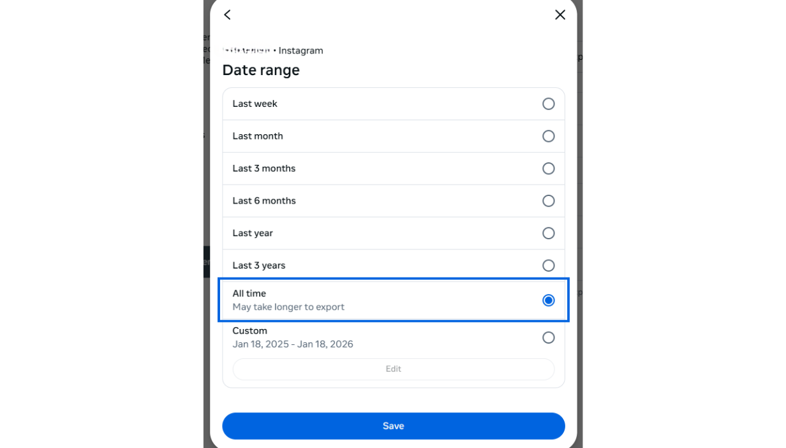
</div>

**5. Save and Create the Report**

*Wait for the email from Instagram (usually takes 5-10 minutes).*

**6. Place Files in Folder**
Download the ZIP file from the email and extract it.
Find the folder `connections` -> `followers_and_following`.
Copy these two files into this project folder (where `main.py` is):
* `followers_1.json` (or just `followers.json`)
* `following.json`

<div align="center">
  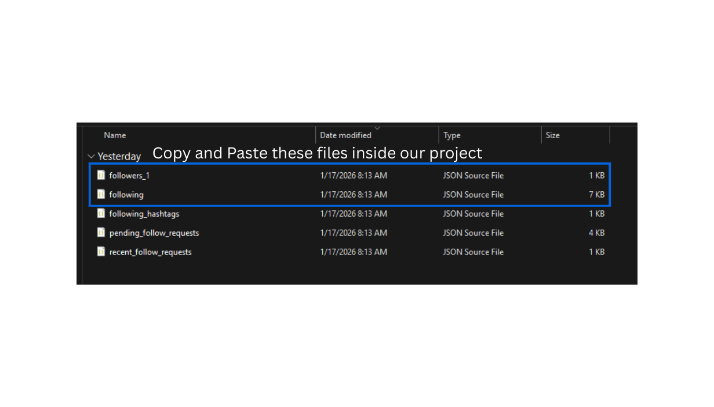
</div>

</details>

<details>
<summary><strong>Step 4: Get Your Session Keys</strong> (The "Login" Part)</summary>

Since we aren't using passwords, we need your "Session ID" and "CSRF Token" to prove to Instagram that it's really you.

**1. Open Developer Tools:**
Open **Google Chrome** or **Edge** and log in to `instagram.com`. Right-click anywhere on the page and select **Inspect** (or press `F12`).

**2. Locate Cookies:**
In the panel that opens, click the **Application** tab at the top (click `>>` if you don't see it). On the left, expand **Cookies** and click on `https://www.instagram.com`.

**3. Copy Values:**
Find the rows named `sessionid` and `csrftoken`. Double-click the **Value** column for each and copy the long string.

<div align="center">
  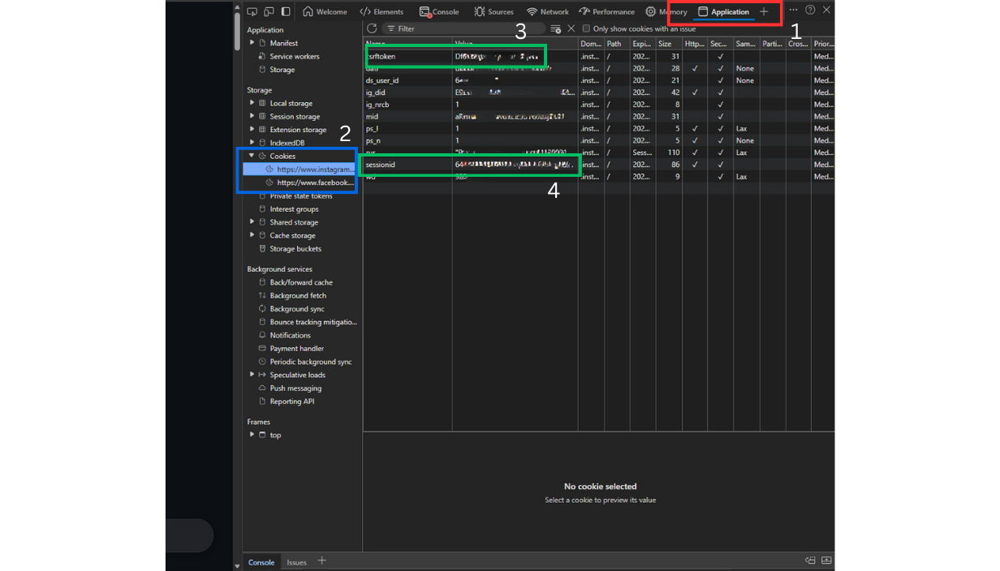
</div>

</details>

<details>
<summary><strong>Step 5: Configure the Bot</strong></summary>

Now we tell the bot who you are.

1.  In the project folder, locate the file named `config.example.json`.
2.  **Rename** it to `config.json`.
3.  Open `config.json` with any text editor (Notepad, TextEdit, VS Code).
4.  Paste your details carefully:

```json
{
  "username": "your_instagram_username",
  "session_id": "PASTE_THE_LONG_SESSION_ID_HERE",
  "csrf_token": "PASTE_THE_CSRF_TOKEN_HERE",
  "max_unfollows_per_day": 20,
  "dry_run": true,
  "whitelist": [
    "instagram",
    "cristiano",
    "your_best_friend"
  ]
}
```

* **max_unfollows_per_day:** Keep this low (20-50) to stay safe.
* **dry_run:** Keep this `true` for the first time to test it.
* **whitelist:** Add usernames of people you **never** want to unfollow.
</details>

<details>
<summary><strong>Step 6: Run the Tool!</strong></summary>

You are ready!

1.  Open your Terminal/Command Prompt in the project folder.
2.  Run this command:

```bash
python main.py
```

### Understanding the Output
* **Dry Run Mode:** If `dry_run` is `true`, the bot will list everyone it *would* remove, but it won't actually do it.
* **Active Mode:** If you are happy with the list, open `config.json`, change `"dry_run": false`, save the file, and run the command again.

The bot will now verify each user and unfollow them one by one, waiting random amounts of time (40-100 seconds) between each action.
</details>

---

## ❓ Troubleshooting

**Q: I get a `KeyError: 'value'` or JSON error.**
A: Instagram changed their data format again. Ensure you downloaded the data in **JSON** format, not HTML. If the error persists, check if `followers_1.json` is inside the project folder.

**Q: It says "Login Failed" or "Connection Error".**
A: Your `sessionid` might have expired. Log out of Instagram on your browser, log back in, and repeat Step 4 to get a fresh Session ID.

**Q: How often can I run this?**
A: We recommend running it once a day. Do not run it multiple times a day to exceed the limit. Slow and steady wins the race (and keeps your account)!

---

## 📂 File Structure

For the curious, here is how the project is organized:

```text
instagram-unfollower/
├── .github/                # GitHub templates (Issues, PRs)
├── assets/                 # Images for documentation
├── config.json             # Your settings (NEVER SHARE THIS - GitIgnored)
├── config.example.json     # Template for users to copy
├── followers_1.json        # Your downloaded data (GitIgnored)
├── following.json          # Your downloaded data (GitIgnored)
├── main.py                 # The brain of the project
├── requirements.txt        # List of dependencies
├── .gitignore              # Security rules
├── CONTRIBUTING.md         # Guidelines for developers
├── LICENSE                 # Legal protection (MIT)
└── README.md               # This help file
```
